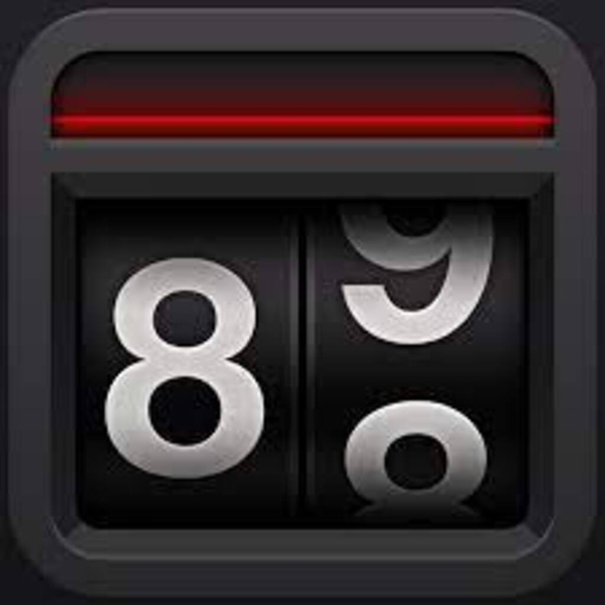
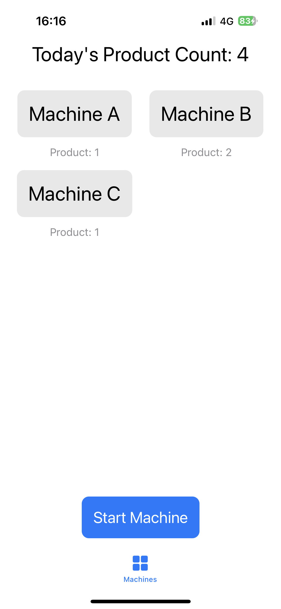
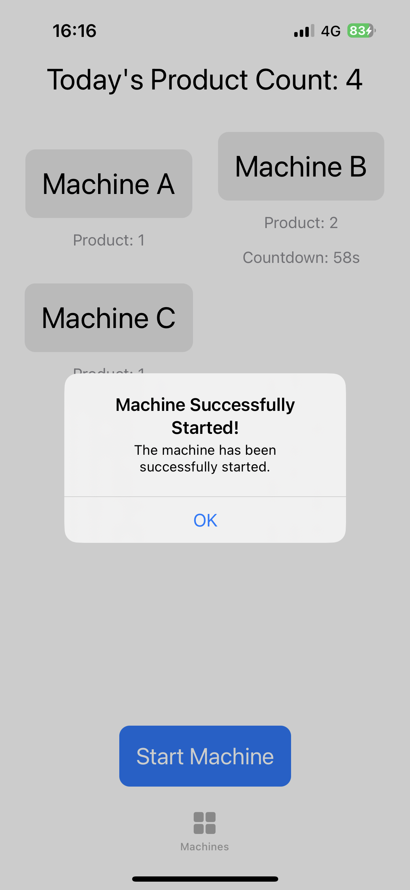
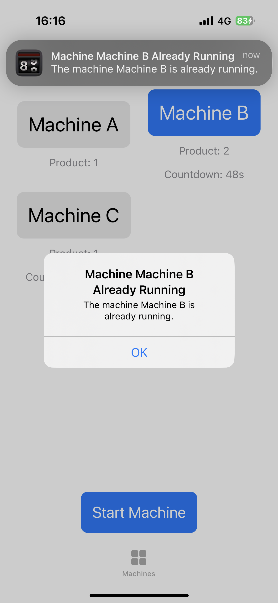
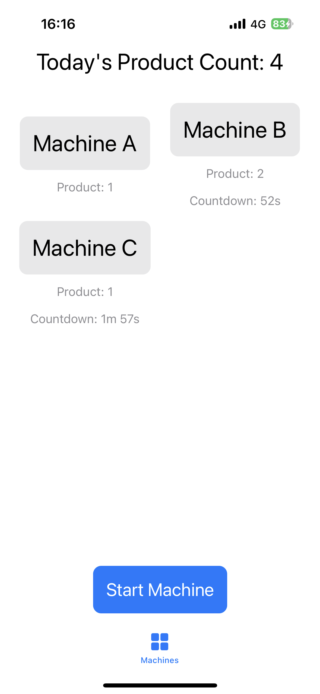
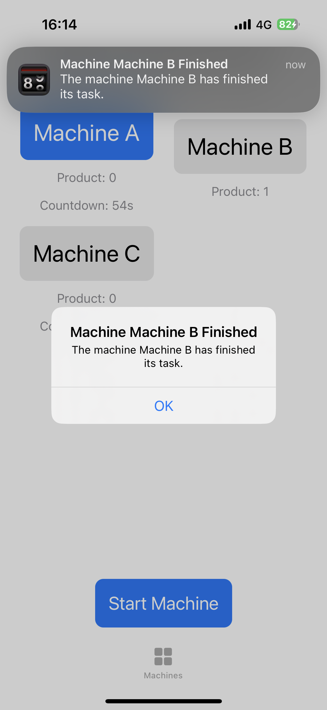

# **Product Count App**

## 🚀 **Getting Started**
This repository contains an iOS application developed using Swift and Xcode. In the app user can track today's product count and each machine's working progress.

 

## 🖥️ **How to Run**

1. Open the app.
 
 

2. Select machine and click start machine button.

 

If machine is already producing a product, it cannot start to produce another one. 

3. Timer will appear on the screen. 

 

* Machine B and Machine C is currently working.

4. Notification will pop up when machine is done.

 

## 🤓 **Maintainers** 
Sude Fidan(@sudefidan)

## 📖  **Referencing** 
* https://developer.apple.com/documentation/uikit/appearance_customization
* https://developer.apple.com/documentation/xcode/specifying-your-apps-launch-screen
* https://developer.apple.com/documentation/usernotifications/setting_up_a_remote_notification_server
* https://www.img2go.com/resize-image
* https://dev.to/sam_programiz/swiftui-user-notifications-341a

